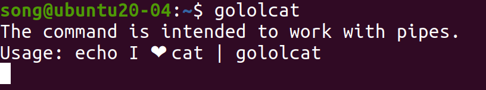
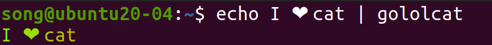
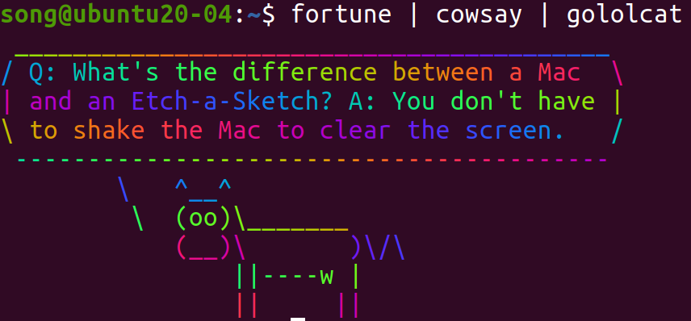

# GOLOLCAT
Go implementation of the lolcat command

## How to build
Build go source code into executable binary file:
```bash
go build -o gololcat .
```
Move it to /usr/bin:
```bash
sudo mv gololcat /usr/bin/
```
Check if command is ready. 


## How to use
Run example:
```bash
echo I ❤ cat | gololcat
```

Get rainbow cat:
```bash
fortune | cowsay | gololcat
```


## Reference
- [lolcat](https://github.com/busyloop/lolcat)
- [go fmt.Printf color](https://gist.github.com/ik5/d8ecde700972d4378d87)
- [read pipe output by using go os.Stdin](https://stackoverflow.com/questions/22744443/check-if-there-is-something-to-read-on-stdin-in-golang)
- [juejin post](https://juejin.cn/post/7118777376263110669/)
